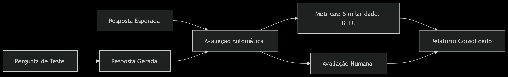

# **README – Chatbot: TransformMind**

## **1. TransformMind**

Um chatbot inteligente para responder dúvidas sobre transformação digital, maturidade digital, tecnologias emergentes e estratégias organizacionais.

---

## **2. Descrição Geral**
 
### O que?

A transformação digital tornou-se um fator determinante para a competitividade e inovação nas organizações. No entanto, avaliar o nível de maturidade digital de uma empresa ainda é um desafio complexo, que requer a análise de múltiplos fatores, como cultura organizacional, adoção de tecnologia, processos e estratégias.

Este projeto propõe o desenvolvimento de um chatbot para interagir com usuários e avaliar o nível de maturidade digital de suas organizações com base em parâmetros estruturados previamente definidos por meio de pesquisa.


### Por que?

Atualmente, a avaliação da maturidade digital é feita por diagnósticos manuais, consultorias especializadas ou questionários extensos, sendo processos custosos, demorados e subjetivos. Muitas organizações não possuem recursos ou conhecimento suficiente para realizar uma autoavaliação eficaz. Um chatbot automatiza essa tarefa, oferecendo:

 - Experiência interativa e acessível
 - Autoavaliação rápida
 - Resultados baseados em dados e ontologias validadas

### Como?

O chatbot utiliza técnicas de Processamento de Linguagem Natural (PLN), incluindo:

NLU (Natural Language Understanding) para compreensão do usuário

NLG (Natural Language Generation) para gerar respostas naturais

Seu modelo de aprendizado é treinado aplicando Machine Learning e redes neurais para melhorar a precisão da classificação.

### Objetivo 

Usar as tecnicas e ferramentas de Processamento de Linguagem Natural (PLN) para desenvolver um chatbot com o intuito de avaliar a maturidade digital dentro das organizações, por meio de interações com usuários. Avaliando o nivel de maturidade digital por meio de parametros estruturados, pois, o contexto de Transformação digital se tornou determinante para a inovação e competitividade das organizações requerindo um analise de fatores, como *cultura organizacional*, *adoção de tecnologia*, *processos* e *estratégias*. Com isso, podemos proporcionar às organizações  uma ferramenta para avaliação da maturidade digital, auxiliando na identificação de lacunas e formulação de estrategias de transformação digital.

---

## 🔧 **3. Funcionalidades**

Principais funcionalidades implementadas:

* Responder perguntas sobre transformação digital
* Classificação de intents (ex: customer experience, processos, cultura)
* Extração de entidades relevantes
* Geração de respostas contextualizadas
* Rephrase de perguntas para treinamento contínuo

---

## 🏗️ **4. Estrutura do Projeto**

Organização dos arquivos e pastas:

```
/chatbot_transformacao_digital
│
├── data/                               # Bases de conhecimento e datasets
├── documents/                      # Documentos brutos (PDFs, artigos, relatórios)
├── input/                          # Arquivos de entrada para processamento
├── output/                         # Resultados processados e datasets finais
│
├── model_train/                        # Diretório de modelos treinados organizados
│   ├── model_train_category/
│   │   └── versions/                   # Versões de modelos de classificação de categoria
│   ├── model_train_intent/
│   │   └── versions/                   # Versões de modelos de classificação de intents
│   └── model_train_maturity_score/
│       └── versions/                   # Versões de modelos de maturidade digital
│
├── image/                              # Imagens geradas, plots de treinamento e resultados
│   ├── model_train_category/
│   │   └── versions/                   # Gráficos do treinamento do modelo de categoria
│   ├── model_train_intent/
│   │   └── versions/                   # Gráficos do treinamento do modelo de intents
│   └── model_train_maturity_score/
│       └── versions/                   # Gráficos do treinamento do modelo de maturidade digital
│
├── log/                                # Logs de execução e treinamentos
│
├── src/                                # Código-fonte principal
│   ├── dao/                            # Data Access Objects (interfaces com banco de dados)
│   ├── helpers/                        # Funções utilitárias gerais para o projeto
│   ├── model/                          # Scripts de treinamento e avaliação de modelos
│   ├── resource/                       # Arquivos de configuração, dicionários, mappings
│   ├── utils/                          # Funções utilitárias específicas (ex: logs, formatação)
│   ├── main.py                        # Script principal para execução geral do projeto (como extração de dados, treinamento dos modelos e teste das interações com os modelos)
│   └── main_chatbot.py                # Script principal com a interface gráfica do chatbot (integrado o o streamlit)
│
├── requirements.txt                   # Dependências do projeto
├── README.md                          # Documentação geral
└── LICENSE                            # Licença de uso

```

---

## 🧠 **5. Tecnologias e Ferramentas**

As principais tecnologias utilizadas:

* **Linguagem:** Python 3.9.13
* **Bibliotecas:**
---

1. ### **Pacotes de NLP e Transformers**

   * `accelerate==1.4.0`
   * `transformers==4.41.0`
   * `sentence-transformers==3.4.1`
   * `sentencepiece==0.2.0`
   * `keybert==0.9.0`
   * `deep-translator==1.11.4`
   * `langid==1.1.6`
   * `langcodes==3.5.0`
   * `huggingface-hub==0.29.1`
   * `datasets==3.3.2`

2. ### **Spacy e modelos**

   * `spacy==3.8.7`
   * `en-core-web-sm`
     [Baixar modelo](https://github.com/explosion/spacy-models/releases/download/en_core_web_sm-3.8.0/en_core_web_sm-3.8.0-py3-none-any.whl)
   * `pt-core-news-sm`
     [Baixar modelo](https://github.com/explosion/spacy-models/releases/download/pt_core_news_sm-3.8.0/pt_core_news_sm-3.8.0-py3-none-any.whl)
   * `spacy-legacy==3.0.12`
   * `spacy-loggers==1.0.5`

3. ### **Pré-processamento e NLP Clássico**

   * `nltk==3.9.1`
   * `regex==2024.11.6`

4. ### **Machine Learning**

   * `scikit-learn==1.6.1`
   * `scipy==1.10.1`
   * `joblib==1.4.2`
   * `torch==2.3.0`

5. ### **Visualização de Dados**

   * `matplotlib==3.9.4`
   * `matplotlib-inline==0.1.7`
   * `seaborn==0.13.2`
   * `plotly==5.22.0`
   * `pyLDAvis==3.4.1`

6. ### **Manipulação de Dados**

   * `numpy==1.26.4`
   * `pandas==2.2.3`

7. ### **Streamlit e Utilitários Web**

   * `streamlit==1.36.0`
   * `python-dotenv==1.0.1`

8. ### **Outros Utilitários**

   * `decorator==5.2.1`
   * `python-json-logger==3.2.1`
   * `python-dateutil==2.9.0.post0`
   * `pytz==2025.1`
   * `pyparsing==3.2.3`
   * `PyPDF2==3.0.1`
   * `pymongo==4.13.0`
   * `language_data==1.3.0`

---

* **Modelos:**

    * `Vamsi/T5_Paraphrase_Paws`
    * `google/flan-t5-base`
    * `paraphrase-mpnet-base-v2`
    * `all-MiniLM-L6-v2`
    * `BERT`

* **Outros:** Git e VSCode.

---

## 🚀 **6. Como Executar o Projeto**

Passo a passo para execução local:

1. Clone o repositório

   ```bash
   git clone https://github.com/CharlesVilela/project_pnl.git
   cd chatbot_transformacao_digital
   ```
2. Crie um ambiente virtual

   ```bash
   python -m venv venv
   source venv/bin/activate  # Linux/macOS
   venv\Scripts\activate     # Windows
   ```
3. Instale as dependências

   ```bash
   pip install -r requirements.txt
   ```
4. Execute a aplicação

   ```bash
   streamlit run src/app.py
   ```

---

## 🧪 **7. Exemplos de Uso**

### Exemplo 1 - Interação por texto
> **Usuário (texto):** O que é exatamente a transformação digital no cenário de negócios atual?<br>
> **Chatbot (texto):** - A transformação digital no cenário de negócios atual é uma mudança na maneira como as empresas operam e interagem com seus clientes, funcionários e outras partes interessadas. É também uma mudança na maneira como as pessoas interagem com produtos e serviços, bem como como as empresas podem fazer melhor uso da tecnologia e da infraestrutura, relata o Wall Street Journal. "A transformação digital é a evolução da capacidade de uma organização de ser mais eficiente, mais receptiva e mais receptiva às necessidades dos clientes", diz um especialista em transformação digital da Universidade da Califórnia, Berkeley. "Está mudando a maneira como interagimos com nossos clientes, tornando -os mais conscientes do que eles podem fazer e de como eles podem ajudá -los a alcançar seus objetivos".

### Exemplo 2 - Interação por áudio
> **Usuário (áudio):** [Áudio enviado dizendo: "Como uma empresa pode identificar sua prontidão para a transformação digital?"]

**Processo**<br>
1. O chatbot transcreve o áudio para texto utilizando o módulo de transcrição.

2. Realiza a busca semântica e classificação de intent.

3. Gera a resposta textual.

4. (Opcional) Converte a resposta em áudio usando o módulo de TTS (text-to-speech) e envia ao usuário.

> **Chatbot (resposta textual):** - Um "nível de maturidade" indica que o estágio atual da organização na maturidade digital, e uma "recomendação prática" é uma boa maneira de avaliar a prontidão da empresa para a transformação digital. Por exemplo, se você é uma empresa emergente, concentre -se na integração, consistência e alinhamento interno. Para uma empresa líder, destaque otimização, escalabilidade e desempenho. Para uma organização emergente, enfatize a inovação, a orquestração do ecossistema e a diferenciação competitiva.
> **Chatbot (resposta áudio):**[Áudio com a resposta acima gerada com TTS]

---

## ☁ **8. O armazenamento**
Para o armazenamento dos dados foi utilizado o banco de dados **MongoDB Atlas**. Por conta:

  1. **Escalabilidade e Flexibilidade:**
    MongoDB Atlas oferece escalabilidade horizontal automática, permitindo o armazenamento de grandes volumes de dados não estruturados ou semiestruturados sem restrições rigidas de esquema

  2. **Modelo de dados Natural para documentos NLP:**
    Utiliza o formato JSON-like (BSON), que se adapta a documentos de conhecimento, resultados de inferências, classificações de intents e entities, eliminando a necessidade de múltiplas tabelas relacionais complexas.

  3. **Fácil integração com aplicações Python:**
    Com bibliotecas como pymongo e conectores nativos, a integração com o pipeline de processamento de linguagem natural é direta, permitindo armazenar e consultar resultados de forma rápida.
  4. **Disponibilidade Multi-Cloud:**
    Permite deploy em diferentes provedores e regiões, aumentando a flexibilidade e aderência a estratégias corporativas multicloud.

O banco de dados se divide em dois tipos de dados: o primeiro utilizado para o treinamento do modelo e consulta do contexto para a geração de resposta do chatbot; e o segundo que armazena um cache de interações dos usuários que é utilizado para otimizar o tempo de resposta do chatbot.

### 💾 **1. Dataset - Treinamento do modelo**

Como não foi encontrada uma base pública pronta, foi criada uma **base de dados própria** utilizando:

### 🔎 **Fontes**

1. **Artigos acadêmicos**

   * *Exemplo:* **Digital transformation: What we have learned (thus far) and what is next** – Consensus

| **Tipo**         | **Título**                                                                 | **Autor** | **Ano de publicação** |
| ---------------- | -------------------------------------------------------------------------- | --------- | --------------------- |
| `artigo`         | A Systematic Review of the Literature on Digital Transformation: Insights and Implications for Strategy and Organizational Change |  André Hanelta, René Bohnsack et. all         | 2021                     |
| `artigo`         | Understanding digital transformation: A review and a research agenda                                               | Gregory Vial         | 2019                     |
| `artigo`          | Digital transformation: a review, synthesis and opportunities for future research                            | Swen Nadkarni e Reinhard Prugl        | 2020                     |
| `artigo` | Digital transformation: A review and research agenda                                       | Dmitry Plekhanov, Henrik Franke et. all         | 2023                    |
| `artigo`      | Digital transformation: What we have learned (thus far) and what is next | Sabrina Schneider e Olga Kokshagina | 2020                  |
| `artigo`         | Digital transformation: A multidisciplinary reflection and research agenda                                               | Peter C. Verhoef, Thijs Broekhuizen et. all         | 2019                     |
| `artigo`          | Digital Transformation Leadership Characteristics: a Literature Analysis                            |  Patrick McCarthy, David Sammon et. all       | 2021                    |
| `artigo` | Defining digital transformation: Results from expert interviews                                       | Ines Mergel, Noella Edelmann et. all        | 2019                    |
| `artigo`      | Influence of Digital Transformation Capability on Operational Performance | Jiatong Yu, Jiajue Wang et. all | 2022                  |
| `artigo`         | The role of digital transformation practices in the operations improvement in manufacturing firms: A practice-based view                                               | Meng Tian, Yang Chen et. all         | 2023                    |
| `artigo`          | The Effects of Digital Transformation on Firm Performance: Evidence from China's Manufacturing Sector                 | Lei Guo e Luying Xu        | 2021                    |
| `artigo` | Does digital transformation improve the operational efficiency of Chinese power enterprises         | Boqiang Lin e Yongjing Xie        | 2023                     |
| `artigo`      | Digital Transformation in Business Operations Management | Nur Rohmah e Komarudin | 2023                  |
| `artigo`         | Operational research and business intelligence as drivers for digital transformation          | Pavlos Delias e Fotis C. Kitsios         | 2023                     |
| `artigo`          | Digital Transformation in Process Industries                   | Joseph Ting         | 2021                     |
| `artigo` | Research on the Impact of Digital Transformation on Enterprise Operational Efficiency           | Boru Lei         | 2025                    |
| `artigo`      | Broadband infrastructure and enterprise digital transformation: Evidence from China | Meng Li, Zhengqi Wang et. all | 2024                  |
| `artigo`         | Transforming the Customer Experience Through New Technologies                                              | Wayne D. Hoyer, Mirja Kroschke et. all         | 2020                     |
| `artigo`          | Solving the crisis of immediacy: how digital technology can transform the customer experience        | Salvatore Parise, Patricia J. Guinan et. all         | 20216                    |
| `artigo` | Digital Transformation and the Customer Experience: Enhancing Engagement and Loyalty | Antonius Felix e Glisina Dwinoor Rembulan        | 2023                   |
| `artigo`     | The Effects of Digital Transformation on Firm Performance: The Role of Customer Experience and IT Innovation | Rawan Masoud e Sarah Basahel | 2023                  |
| `artigo`         | The digital transformation of business. Towards the datafication of the relationship with customers     | Cristina Fernández-Rovira, Jesús Álvarez Valdés et. all        | 2021                    |
| `artigo`          | Digital transformation and customer value creation in Made in Italy SMEs: A dynamic capabilities perspective      | Michela Matarazzo, Lara Penco et. all         | 2021                     |
| `artigo` | Complexity of Creating Customer Experience under the Influence of Digital Transformation  | Iva Gregurec, Lucija Tomasek et. all         | 2022                     |
| `artigo`      | Exploring the Impact of Digital Transformation on Business Operations and Customer Experience | Dr. Sayyad Vakeel Agmad Munaf Ali, Dr. Monika Sharma et. all | 2024                  |
| `artigo`         | Adoption paths of digital transformation in manufacturing SME    | Elisa Battistoni, Simone Gitto et. all         | 2022                   |
| `autor`          | Nome do(s) autor(es) ou organização responsável                            | -         | -                     |
| `ano_publicacao` | Ano em que o documento foi publicado                                       | -         | -                     |
| **Exemplo**      | *Digital transformation: What we have learned (thus far) and what is next* | Consensus | 2024                  |


---

### 🌐 **Sites consultados**

* [Google Academico](https://scholar.google.com/?hl=pt-BR)
* [Consensus](https://consensus.app/search/)

---

#### 🗃️ **Estrutura da base de dados**

| **Campo**        | **Descrição**                                                    |
| ---------------- | ---------------------------------------------------------------- |
| `text`           | Pergunta, afirmação ou trecho relevante extraído                 |
| `intent`         | Intenção comunicativa do texto                                   |
| `maturity_score` | Grau de maturidade digital (0 a 1)                               |
| `entities`       | Lista de entidades nomeadas (ex: organizações, pessoas, locais)  |
| `category`       | Classificação geral (ex: arquitetura organizacional, estratégia) |
| `metadata`       | Informações adicionais (fonte, data, autor, etc)                 |


### 🔄 **2. Dataset - Cache das interações**

O objetivo da utilização do cache de interações é otimizar o tempo de resposta levado para o chatbot consegui retornar uma resposta para o usuário.

#### **Estrutura do Cache de Interações**

| **Campo**        | **Descrição**                                                    |
| ---------------- | ---------------------------------------------------------------- |
| `user_input`           | Pergunta do usuário                |
| `response`         | Resposta gerada pelo chabot                                    |
| `userid` | Identificador da sessão, ou seja, para cada sessão iniciada é gerado um uuid daquela sessão                                |
| `timeresponse`       | Tempo que o chatbot leva para gerar uma resposta  |
| `datetime`       | Data e hora da interação |
| `isQuestionAudio`       | Indica se a pergunta do usuário foi em audio                |
| `isResponseAudio`       | Indica se a resposta do chatbot foi em audio                |


---

## 📊 **9. Metodologia**

- A base de dados foi criada manualmente por meio de artigos baseados em Maturidade digital. Com isso, o sistema conta com uma base de conhecimento fundamental em maturidade digital, que foi aprimorado com tecnicas de aprendizado de maquina (ML) e redes neurais para melhorar a classificação do modelo.
  
- Utilizado para o desenvolvimento desse chatbot:
  - Natural Lanaguage Undestanding - (NLU)
  - Natural Language Generation - (NLG) 

 Abordagem explicada:

* Pré-processamento (tokenização, stopwords)
  * Utiliza-se o spaCy com o modelo `en_core_web_sm` para:
    * Criar um Entity Ruler personalizado para identificação de entidades especificas nos textos
    * Realizar a tokenização e lematização de cada texto, gerantindo a padronização linguistica antes do trienamento.
    * Após o pré-processamento, os dados passam pela função `map_score_to_label(score)`, que mapeia os scores dos textos em três classes:
     * 'low', 'average' e 'high'
       
* Vetorização ou embeddings utilizados
  * É aplicado TF-IDF para gerar a matriz de vetores:

    ```
      tfidf_vectorizer = TfidfVectorizer(stop_words='english')
      tfidf_matrix = tfidf_vectorizer.fit_transform(corpus)
     ```

   * Além do TF-IDF, são gerados **embeddings semânticos** com o **SentenceTransformer**, utilizando dois modelos principais:
      * `"all-MiniLM-L6-v2"` para tarefas gerais de embeddings
      * `"paraphrase-mpnet-base-v2"` para tarefas de similaridade semântica mais robusta
        
* Algoritmos de classificação ou geração de texto
   * Classificação
      * Para tarefas de maturity_label e intent, são utilizados três algoritmos clássicos de Machine Learning:
         * Naive Bayes
         * Logistic Regression
         * Random Forest
   * Modelos carregados
      * Modelos treinados como **Logistic Regression** são carregados via `joblib.load` nos caminhos salvos para intent e maturity:

        ```
          intent_model = joblib.load(intent_model_path)
          maturity_model = joblib.load(maturity_model_path)
        ```
    * Geração de texto
       * **Paraphrase Pipeline** com o modelo **"Vamsi/T5_Paraphrase_Paws"** para reescrita de textos.
       * **Flan-T5** `google/flan-t5-base` para tarefas de geração de sequência de texto (seq2seq) com suporte a inferência em **float16** para melhor desempenho.
           
* Métricas de avaliação e resultados


## **10. Resultados**

Os resultados se dividem em três pontos: o funcionamento do chatbot, analise dos resultados dos modelos treinados e a analise das respostas do chatbot. <br><br>


O projeto do chatbot se divide em três partes.

1. O primeiro main é mais voltado para a extração de textos de artigos/livros e do treinamento dos modelos de redes neurais
   - **Parte 1: Extração de textos**
     - Extrai os textos do PDF
       - Limpa textos
     - Extrai as keywords
       - Usa o modelo KeyBERT
     - Identifica o idioma (se o texto é em português ou inglês) para usar o mapeamento correto das categorias com suas palavras-chave
     - Extrai as frases mais relevantes
       - Usa SentenceTransformer
     - Gera um dataset com esses textos
       - Traduz o texto (se for em português, traduz para inglês)
       - Atribui o score
       - Atribui o intent
       - Atribui as entities
       - Atribui a categoria
       - Salva na base de dados

   - **Parte 2: Treinamento dos modelos**
     - Lê a base de dados com os textos extraídos
     - Pré-processa os dados
       - Tokenização e lematização com Spacy
     - Treina os modelos
       - Naive Bayes
       - Logistic Regression
       - Random Forest

2. O segundo main é mais voltado para a parte da interação do usuário com o chatbot, ou seja, nesse main temos o front end do projeto que permite conversar com o chatbot.

   - **Fluxo desse main:**
     - O usuário faz uma pergunta que pode ser em:
       - Áudio
       - Texto
     - Se for em áudio:
       - Transcreve o áudio para texto
     - A pergunta do usuário é buscada primeiramente na base de dados cache
       - Se na base de dados cache já existir uma pergunta 95% similar:
         - Retorna a mesma resposta que está no banco de cache
       - Se a pergunta não estiver na base de dados cache:
         - Passa a pergunta para o modelo
           - Antes de ir diretamente para o modelo:
             - A pergunta do usuário é traduzida para o inglês
           - Depois da tradução:
             - O modelo faz uma busca semântica junto com TF-IDF para buscar o contexto na base de dados
             - O modelo gera uma resposta
           - Com a resposta do modelo gerada:
             - Traduz a resposta para o português
           - Caso a opção de resposta em áudio esteja ativada:
             - Converte o texto em áudio
         - Retorna a resposta para o usuário


### Resultado da analise das respostas do chatbot

A analise dos dados gerados pelo chatbot seguem o fluxo da Figura 02



1. Pergunta de Teste
   * Input: Questões do dataset de validação (ex: "Como a transformação digital impacta cadeias de suprimentos?")
   * Código relacionado: `conversation_chatbot()` que processa perguntas através do modelo
2. Resposta Gerada vs Resposta Esperada
    * Comparação entre:
      * Saída do modelo (resposta gerada)
      * Resposta de referência (gold standar)
     * Código `calculate_similarity` que usa embeddings para comparar semelhança
3. Avaliação Automática
    * Métricas calculadas
       * Similaridade (Cosine): `cosine_similarity(response_embedding, reference_embedding)`
       * BLEU: `sentence_bleu([reference_tokens], generated_tokens)`
       * ROUGE-L: `rouge_l_score(reference, generated)`
       * METEOR: `meteor_score([reference], generated)`
     * Código: `test_analise.py` contendo todas as funções de cálculo
4. Relatório Consolidado
    * Agrega resultados de todas as perguntas
    * Gera estrutura JSON com:
       * Métricas médias
       * Resultados detalhados por pergunta
       * Identificação de pontos fracos
 5. Análise de Pontos Fracos
   * Detecta padrões problemáticos

     ```
        def identify_weak_points(self):
        """Identifica áreas problemáticas com base nas avaliações"""
        weak_points = {
            "low_semantic_similarity": [],
            "human_low_scores": []
        }
        
        # Identificar respostas com baixa similaridade semântica
        for item in self.results:
            if item['auto_metrics']['cosine_similarity'] < 0.6:
                weak_points["low_semantic_similarity"].append({
                    "question": item['question'],
                    "score": item['auto_metrics']['cosine_similarity']
                })
        
        # Identificar respostas com baixa avaliação humana
        for item in self.results:
            if item['human_evaluation']:
                low_scores = [
                    metric for metric, score in item['human_evaluation']['scores'].items() 
                    if score < 3
                ]
                if low_scores:
                    weak_points["human_low_scores"].append({
                        "question": item['question'],
                        "criteria": low_scores,
                        "comments": item['human_evaluation']['comments']
                    })
        
        return weak_points
     ```
### Analise do treinamento

Os modelos foram treinados para 2 tarefas distintas:
   * `maturity_label` (Classificação de maturidade)
   * `intent` (Classificação de intenção

Cada tarefa foi testada com 3 algoritmos: Naive Bayes, Regressão Logística e Random Forest

#### Tabelas
##### **1. Maturity Label**

| **Modelo**           | **Accuracy** | **Macro Avg (F1-score)** | **Weighted Avg (F1-score)** |
|-----------------------|:------------:|:------------------------:|:---------------------------:|
| Naive Bayes           | 0.911        | 0.493                    | 0.894                       |
| Logistic Regression   | 0.937        | 0.661                    | 0.933                       |
| Random Forest         | 0.950        | 0.738                    | 0.949                       |

---

##### **2. Intent**

| **Modelo**           | **Accuracy** | **Macro Avg (F1-score)** | **Weighted Avg (F1-score)** |
|-----------------------|:------------:|:------------------------:|:---------------------------:|
| Naive Bayes           | 0.843        | 0.096                    | 0.801                       |
| Logistic Regression   | 0.925        | 0.248                    | 0.917                       |
| Random Forest         | 0.952        | 0.422                    | 0.947                       |

### Principais Padrões Observados

1. **Maturity Label**
    * Melhor modelo: Random Forest
        * Accuracy: 0.950
        * Macro Avg F1: 0.738
        * Weighted Avg F1: 0.949
     * Observações:
         * O Random Forest apresentou desempenho superior em todas as métricas.
         * Logistic Regression também teve performance alta, mas levemente inferior em macro avg, indicando menor equilíbrio entre classes.
         * Naive Bayes teve o pior desempenho, especialmente na macro avg (0.493), evidenciando dificuldade em classes minoritárias.

2. Intent
    * Melhor modelo: Random Forest
      * Accuracy: 0.952
      * Macro Avg F1: 0.422
      * Weighted Avg F1: 0.947
    * Observações
       * Apesar da alta accuracy (~95%), o macro avg F1 é baixo (0.422) em todos os modelos, sugerindo que:

         * O modelo acerta predominantemente classes majoritárias.
         * Classes minoritárias têm performance insatisfatória.

       * Logistic Regression apresentou macro avg F1 melhor (0.248) que Naive Bayes (0.096), mas ambos muito baixos.
          
**Insights Gerais**
 - Random Forest foi consistentemetne o melhor modelo em todas as tarefas
 - Logistic Regression teve desempenho competitivo, especialmente para maturity_label
 - Naive Bayes apresentou desempenho fraco, sugerindo inadequação aos seus dados de alta dimensionaldiade e distribuição desequilibrada.


<br>
### Desempenho do chatbot

A tabela abaixo é uma pequena amostra dos dados gerados pelos modelos de avaliação. Para ver o arquivo json completo clique aqui: [Ver arquivo JSON completo](full_evaluation_report.json)

##### Desempenho do Modelo (Resumo)

| Categoria          | Métrica             | Valor Médio | Observação                           |
|--------------------|---------------------|-------------|--------------------------------------|
| **Amostra**        | Total de Respostas  | 67          |                                      |
| **Similaridade**   | Cosine Similarity   | 0.6816      | 0 (sem relação) → 1 (idêntico)       |
| **Qualidade**      | ROUGE-L             | 0.0903      | Coerência de sequências              |
|                    | METEOR Score        | 0.0993      | Precisão por alinhamento             |
|                    | BLEU Score          | 0.0027      | Similaridade n-gram                  |
| **Humano**         | Relevância          | 2.6/5       | Relação com o tema                   |
|                    | Correção            | 2.0/5       | Precisão factual                     |
|                    | Completude          | 1.6/5       | Abrangência da resposta              |
|                    | Clareza             | 2.0/5       | Facilidade de compreensão            |

**Principais Insights**

1. Forças
   * Boa compreensão conceitual (similaridade semântica aceitavel)
   * Desempenho superior em tópicos estratégicos (ex: definições de transformação digital)
2. Desafios Críticos
    * Baixa completude (63% abaixo do esperado)
    * Clareza insuficiente (40% das respostas confusas)
    * Problemas graves em temas técnicos especificos
3. Futuras melhorias
    * Implementar verificações contra alucinações
    * Desenvolver submodelos especializados para domínios técnicos


**Principais Desafios:**  
▸ Completude 68% abaixo do ideal  
▸ Clareza insuficiente em 40% das respostas  
▸ Dificuldade em tópicos técnicos específicos

---

## 👥 **10. Contribuidores**

Os membros do projeto:

* **Charles Vilela** – [GitHub](https://github.com/charlesvilela) | [LinkedIn](https://linkedin.com/in/charlesvilela)
* **Gabriel Lima** – [GitHub](https://github.com/Gabs19) | [LinkedIn](https://www.linkedin.com/in/gabriel-lima-861181168/)

---

## 💡 **11. Futuras Implementações**

Melhorias ou próximos passos:

* Treinar modelos maiores para geração de resposta
* Deploy em nuvem (AWS, GCP)
* Melhorar integração com plataformas de atendimento ao cliente
* Dashboard de analytics de interação

---

